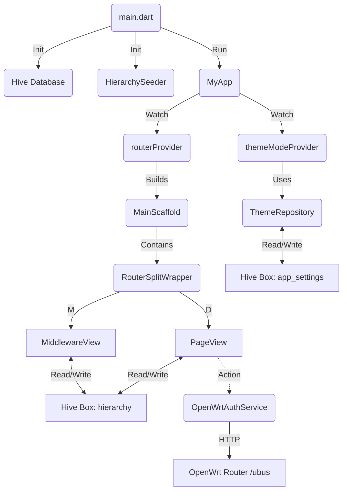

# easywrt Design Document

## 1. Architectural Overview

The **easywrt** project is a Flutter application designed to interact with OpenWrt routers. It employs a **Feature-First** architecture combined with principles of **Clean Architecture** for separation of concerns.

### Key Technologies
-   **Framework**: Flutter (Dart 3.x)
-   **State Management**: `flutter_riverpod`
-   **Navigation**: `go_router` (Declarative routing)
-   **Persistence**: `hive` (NoSQL database for local storage)
-   **Networking**: `dio` (HTTP client for OpenWrt uBus API)

### High-Level Pattern
The application follows a reactive data-driven pattern:
1.  **UI Layer**: Widgets observe state providers and local database changes.
2.  **Logic Layer**: Riverpod `Notifiers` and `Providers` manage application state (e.g., Theme, Auth).
3.  **Data Layer**:
    -   **Repositories**: Abstract data access (e.g., `ThemeRepository`).
    -   **Services**: Handle external API calls (e.g., `OpenWrtAuthService`).
    -   **Local DB**: Hive boxes store settings and the dynamic navigation hierarchy.

---

## 2. Directory Structure & Module Responsibilities

The `lib/` directory is organized by feature and layer:

```text
lib/
├── main.dart               # Entry point; initializes Hive, Riverpod, and runs the app.
├── router.dart             # GoRouter configuration; defines routes and the ShellRoute.
├── main_scaffold.dart      # Root UI Shell; handles responsive navigation (Rail vs. BottomBar).
├── beam/                   # Shared UI components (App Bars, Navigation layouts).
├── db/                     # Database layer.
│   ├── hive/               # Hive initialization and adapters.
│   └── models/             # Data models (Hive types).
├── modules/                # Feature modules.
│   ├── router/             # "Router" feature (Dynamic navigation hierarchy).
│   └── setting/            # "Setting" feature (App configuration).
└── utils/                  # Core services and utilities.
```

---

## 3. Module Details & Calling Relations

### A. Core / Navigation
*   **`MyApp` (`lib/main.dart`)**: The root widget. Watches `themeModeProvider` and `routerProvider` to rebuild the app on theme or route changes.
*   **`routerProvider` (`lib/router.dart`)**: Defines the app's routing map. It wraps the main content in a `ShellRoute`, which renders the `MainScaffold`.
*   **`MainScaffold` (`lib/main_scaffold.dart`)**:
    *   **Calling Relation**: Uses `ResponsiveLayout` to decide between a bottom navigation bar (mobile) or a side navigation rail (desktop/tablet).
    *   **Function**: Acts as the persistent container for all feature pages.

### B. Feature: Router (`lib/modules/router/`)
This module implements a dynamic Master-Detail interface driven by Hive data.
*   **`RouterSplitWrapper`**: The orchestrator widget.
    *   **Calling Relation**: Reads URL query parameters (`mid` for Middleware, `pid` for Page).
    *   **Function**: Splits the view into a list (Master) and content (Detail) on large screens, or shows them individually on small screens.
*   **`MiddlewareView` (Master)**:
    *   **Calling Relation**: Listens directly to the Hive box containing `MiddlewareItem`s using `ValueListenableBuilder`.
    *   **Function**: Displays the list of available router sections. Reorders or updates result in direct writes to Hive, triggering an immediate UI update.
*   **`RouterPageView` (Detail)**:
    *   **Calling Relation**: Fetches specific `PageItem` data from Hive.
    *   **Function**: Renders the actual content widgets for a selected page.

### C. Feature: Setting (`lib/modules/setting/`)
Handles application preferences.
*   **`ThemeNotifier` & `themeModeProvider`**:
    *   **Calling Relation**: Depends on `ThemeRepository`.
    *   **Function**: Exposes the current `ThemeMode` to the UI.
*   **`ThemeRepository`**:
    *   **Calling Relation**: Accesses the `app_settings` Hive box.
    *   **Function**: Reads/writes `AppSettingItem` (theme, language, color) to local storage.

### D. Services & Utilities (`lib/utils/`)
*   **`HttpClient`**: Singleton wrapper for `Dio`. Adds interceptors for logging or global headers.
*   **`OpenWrtAuthService`**:
    *   **Function**: Performs the JSON-RPC login call to the OpenWrt router (`/ubus`).
    *   **Output**: Returns a session ID token.
*   **`SystemInfoService`**:
    *   **Calling Relation**: Uses `HttpClient` and the session token.
    *   **Function**: Fetches `system.info` and `system.board` data from OpenWrt.
*   **`HierarchySeeder`**:
    *   **Function**: Runs on app start to populate the Hive database with default navigation items if it's empty.

---

## 4. Class Calling & Data Flow Diagram (Conceptual)



## 5. Summary of Key Relationships
1.  **Reactive Storage**: The app relies heavily on Hive not just for storage, but as a reactive data source. The `router` module's UI is bound directly to the database, ensuring that any state change (persisted immediately) is reflected in the UI without complex intermediate state management.
2.  **Service Injection**: Network services are standalone classes instantiated as needed (or via simple Providers), utilizing the singleton `HttpClient`.
3.  **Scoped Logic**: Each feature module (`router`, `setting`) encapsulates its own UI, Logic, and Data access patterns, keeping the codebase modular and scalable.
